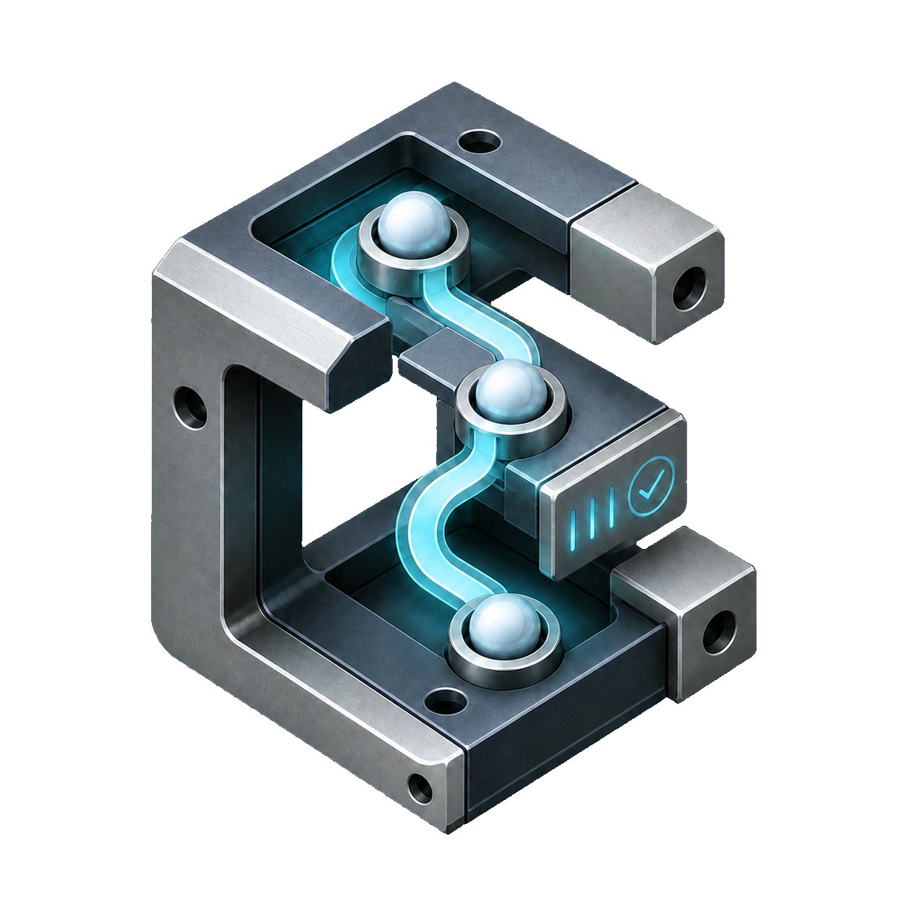
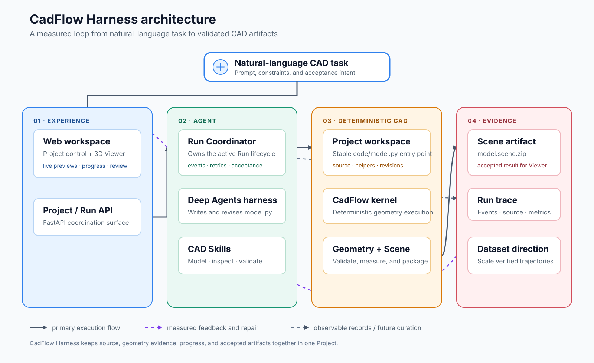

  

<h1 align="center">CadFlow Harness</h1>

  <strong>在本机运行 CAD Agent，直接检查它生成的几何结果。</strong>

  Agent 编写 Python CAD 程序，CadFlow 负责执行和检查。每个 Project 都会保留源码、测量值和运行记录。

  由 
  

  
  
  
  
  
  
  

  <a href="README.md">English</a> ·
  <a href="README.zh-CN.md">简体中文</a>

  <a href="#核心设计">核心设计</a> ·
  <a href="#项目方向">项目方向</a> ·
  <a href="#系统架构">系统架构</a> ·
  <a href="#快速开始">快速开始</a> ·
  <a href="#cad-skill-层">CAD Skills</a>

---

CadFlow Harness 是一个在本机运行参数化 CAD Agent 的工具。模型编写可执行的 Python 程序，CadFlow 用确定性的几何内核运行它，后端保存运行中的测量值、事件和产品文件。

模型输出的是程序。你可以查看源码，修改尺寸或特征，再次运行并比较几何结果。仓库提供运行时、示例、Skills 和测试，不包含训练好的专用模型。

> [!IMPORTANT]
> 当前版本是 Alpha，只适合在可信本机上使用。单零件结果必须是一个有效且体积为正的 solid。Assembly 要保留独立 Part 的边界、定位、连接器和约束。大规模数据集与 CAD 专用后训练仍在规划中，不属于当前功能。

## 文档

- [在线文档（默认中文）](http://119.28.82.252/cadflow-harness/)
- [简体中文文档站](https://zion-zion-zion.github.io/CadFlowAgent/zh/)
- [English documentation site](https://zion-zion-zion.github.io/CadFlowAgent/en/)
- [中文文档源](docs/zh/index.md)
- [English documentation source](docs/en/index.md)

## 核心设计

### Python 是模型的输出

Agent 生成可读的 Python CAD 源码。尺寸和特征顺序都留在文件中，运行后仍可以检查或编辑。

### 用几何检查结果

CadFlow 负责构建几何，运行时负责检查结果。检查项目包括 solid 数量、体积、包围盒、拓扑、截面以及 BREP 或材料差异。这些测量值比单看截图更可靠。

### 每次运行都留下记录

每个 turn 会保存 Prompt、工具调用、源码版本、执行结果、几何测量和生成文件。[重建数据示例](examples/agentic_reconstruction_dataset/README.zh-CN.md)演示了如何在不保存隐藏思维链的情况下整理这些记录。

### 模型层可以替换

Deep Agents Harness 与其他运行组件共用 Project 工作区和 Artifact 契约。更换模型或 Harness 时，执行器、检查逻辑、运行记录和 Viewer 不需要重写。

## 项目方向

| 范围 | 当前已有 | 后续工作 |
| --- | --- | --- |
| Agent 运行时 | 在本地工作区编写、运行、检查和修复 CadFlow 程序。 | 当前可用 |
| 数据集与评测 | 一个小型重建记录示例。 | 扩大收集范围并补充评测 |
| CAD 后训练 | 仓库中没有训练流水线。 | 研究和原型验证 |

表格中的第一项是现在可以使用的功能，后两项属于计划工作。

## 系统架构

  

### 一次建模运行

1. 创建 Project，提交完整的 CAD 任务。
2. 选定的 Harness 读取相关 Skills，并写入 `code/model.py`。
3. CadFlow 执行程序。结果失败或不满足要求时，几何检查会返回测量值。
4. 运行通过后生成 Viewer 使用的 `model.scene.zip`。源码、事件、诊断和其他产物仍保存在 Project 中，方便查看。

## 快速开始

### 环境要求

- Linux x86_64（glibc 2.31 或更高版本）+ Python 3.12，或 macOS 26 arm64 + Python 3.13
- 用于安装缺失工具的 `curl` 或 `wget`
- OpenAI 兼容的模型端点和 API Key

仓库为每个受支持的平台提供一个 CadFlow wheel。`uv` 会根据 `pyproject.toml` 和 `uv.lock` 选择匹配的文件。

### 安装

~~~bash
./setup.sh
~~~

脚本会检测平台，必要时安装 `uv` 或 Node.js，同步锁定的 Python 和 Viewer 依赖，并从示例创建 `.env`，不会覆盖已有文件。只检查现有环境时运行 `./setup.sh --check`。

在 `.env` 中填写模型服务：

~~~dotenv
OPENAI_BASE_URL=https://api.openai.com/v1
OPENAI_MODEL_ID=<model-id>
OPENAI_API_KEY=<api-key>
~~~

### 启动

~~~bash
./run.sh
~~~

`run.sh` 会根据操作系统和架构选择 Python 解释器。打开 [http://localhost:5678](http://localhost:5678)，创建 Project、提交任务、查看进度和最终结果。后端 API 位于 `http://localhost:8765`。

### 运行时配置

| 环境变量 | 默认值 | 用途 |
| --- | --- | --- |
| `OPENAI_BASE_URL` | 未设置 | OpenAI 兼容模型服务的 Base URL。 |
| `OPENAI_MODEL_ID` | 未设置 | Agent Harness 使用的模型。 |
| `OPENAI_API_KEY` | 未设置 | 模型服务凭证，严禁提交到仓库。 |
| `TEXT_TO_CAD_HOST` | `0.0.0.0` | 后端监听地址。 |
| `TEXT_TO_CAD_PORT` | `8765` | 后端端口。 |
| `TEXT_TO_CAD_FRONTEND_HOST` | `0.0.0.0` | Viewer 监听地址。 |
| `TEXT_TO_CAD_FRONTEND_PORT` | `5678` | Viewer 监听端口。 |
| `TEXT_TO_CAD_PROJECTS_ROOT` | `output/projects` | Project 工作区根目录。 |
| `CADFLOW_PREVIEW_TIMEOUT_SECONDS` | `15` | 实时预览 worker 的超时秒数。 |

## 当前建模契约

每个 Project 会在 `code/model.py` 中创建以下入口：

~~~python
import cadflow as cad

def build_model(model: cad.Model) -> cad.Shape | cad.Assembly:
    # Agent 会将该骨架替换为用户请求的产品。
    raise NotImplementedError
~~~

Agent 可以读写 Project 的 `code/` 工作区。单零件结果必须是一个有效的 `cad.Shape`，只包含一个 solid 且体积为正。Assembly 要保留语义化 Part 边界、定位、连接器和约束。后端验证结果并生成 Viewer 使用的 `artifacts/model.scene.zip`。生成代码在受限本机进程中执行，请只在可信机器上运行应用。

## CAD Skill 层

Skills 是按任务加载的 Markdown 参考，以只读方式提供给 Agent。

| Skill | 用途 |
| --- | --- |
| [`cadflow-model-part`](skills/cadflow-model-part/SKILL.md) | 参数化刚性零件、Sketch、特征、布尔、圆角和单 Part 交付。 |
| [`cadflow-flexible-model`](skills/cadflow-flexible-model/SKILL.md) | 静态布料、皮革、薄膜、服装和其他柔性几何。 |
| [`cadflow-step-brep`](skills/cadflow-step-brep/SKILL.md) | STEP/BREP 检查、特征推断、重建和基于测量值的比较。 |
| [`cadflow-model-assembly`](skills/cadflow-model-assembly/SKILL.md) | 多部件产品、定位、连接器、约束和验收。 |
| [`cadflow-rotary-transmission`](skills/cadflow-rotary-transmission/SKILL.md) | 旋转关节、齿轮、轴、壳体和传动机构。 |

## 仓库结构

~~~text
CadFlow Harness/
├── backend/          Agent 运行时、Project API、执行、事件与验证
├── viewer/           浏览器工作区与 Three.js Scene Viewer
├── skills/           CadFlow 工作流与 API 参考
├── examples/         零件、柔性模型、装配体与重建数据
├── tests/            运行时、边界、修复循环与集成测试
└── vendor/           平台特定的 CadFlow Wheel
~~~

[示例目录](examples/README.md)列出了可运行的机械零件、装配体、柔性几何和重建记录示例。

## 检查

~~~bash
# Linux
uv run --locked --python 3.12 pytest

# macOS
uv run --locked --python 3.13 pytest

cd viewer && npm run build
cd .. && ./scripts/docs.sh build
~~~

真实模型服务测试需要显式使用 `-m live_agent`。

## 许可证

CadFlow Harness 使用 [MIT License](LICENSE) 开源许可证。
