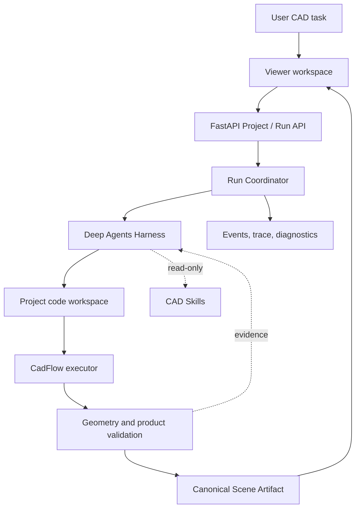

# Architecture

CadFlow Harness keeps interaction, agent behavior, deterministic execution, and
visualization as separate boundaries.

## Boundaries

- **Viewer** manages Project selection, conversation, progress, previews, and
  Scene/product inspection in the browser.
- **FastAPI** exposes Project, message, preview, artifact, and observability
  routes. It owns no CAD modeling policy itself.
- **Run Coordinator** serializes one active turn per Project, starts the Agent
  service, records events, and publishes terminal state.
- **Agent Harness** connects a configured model to bounded file tools and the
  current Project workspace. It is replaceable behind the run contract.
- **Project Workspace** contains only `/code/**/*.py` source visible to the
  Agent. Metadata, logs, previews, review evidence, and artifacts remain
  outside that mount.
- **CadFlow** builds deterministic geometry and exports a canonical Scene.
  Validation and independent review provide measurable acceptance evidence.

The repository also includes modular assembly examples, but examples are not
mounted into an Agent Run. They are references for developers and users.
