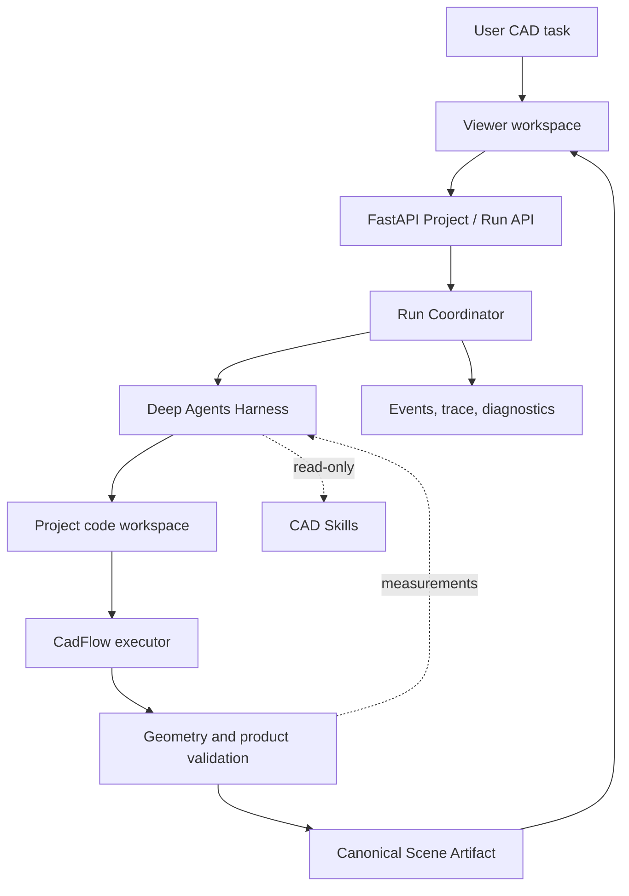

# Architecture

The browser, Agent, geometry executor, and result viewer are separate parts of
the application. Project, Run, and Artifact contracts connect them.

## Responsibilities

- **Viewer** manages Projects, conversation, progress, previews, and Scene or
  product inspection in the browser.
- **FastAPI** serves Project, message, preview, artifact, and trace routes. It
  does not choose a CAD modeling method.
- **Run Coordinator** allows one active turn per Project, starts the Agent,
  records events, and writes the terminal state.
- **Agent Harness** connects the configured model to bounded file tools and the
  current Project workspace. Any harness that follows the Run contract can
  replace it.
- **Project Workspace** exposes only `/code/**/*.py` to the Agent. Metadata,
  logs, previews, review evidence, and artifacts stay outside that mount.
- **CadFlow** builds deterministic geometry and exports the Scene. The
  validator and independent review use measurements to decide whether to accept
  the version.

The assembly examples in the repository are not mounted into Agent Runs. They
are reference programs and test material.
