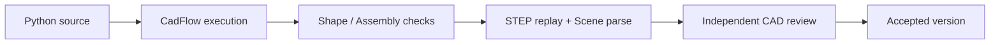

# Geometry validation

The runtime checks the generated geometry directly. A render helps a person
inspect the result, but a screenshot alone cannot accept a product.

## Part checks

For a `cad.Shape`, the executor confirms that the process completed, the result
is one Shape with one valid solid, and its volume is finite and positive. Bounds
and other measurements are saved in diagnostics.

## Assembly checks

For a `cad.Assembly`, the executor checks semantic structure, leaf Part identity,
connected one-solid bodies, component and unique-Part counts, connectors and
placements, strict constraint solving and residuals, and the declared
`PRODUCT_SPEC.envelope.max_size_mm`. It then replays the STEP output and parses
the Scene Artifact.

## Review and acceptance

After the early checks pass, the executor writes a Draft product bundle. The
host calls the independent `cad_review` to inspect the exported STEP and
measurements. The Draft becomes Accepted only when review passes too. Accepted
files go into a versioned directory and appear in the Viewer.

## What validation does not prove

The current checks do not establish strength, tolerance stack,
manufacturability, thermal performance, bearing life, backlash, contact stress,
or other engineering analyses. This runtime checks geometric and semantic
validity only.
