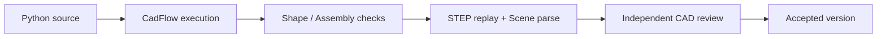

# Geometry validation

The runtime treats geometry as executable evidence. A passing render is useful
for inspection, but it is not enough to accept a product.

## Part gates

For a `cad.Shape` result, the executor checks that the process completed, the
returned result is one shape with one valid solid, and its volume is finite and
positive. Bounds and other measured properties are retained as diagnostics.

## Assembly gates

For a `cad.Assembly`, the executor checks semantic structure, leaf Part
identity, connected one-solid bodies, component and unique-Part counts,
connectors and placements, strict constraint solving and every residual, and
the declared `PRODUCT_SPEC.envelope.max_size_mm`. It then replays STEP output
and parses the Scene Artifact.

## Review and acceptance

The deterministic executor writes a complete Draft product bundle only after
the early gates pass. The host invokes independent `cad_review`, which inspects
the exported STEP and evidence. A Draft becomes Accepted only when review also
passes. Accepted files are copied into a versioned directory and exposed to the
Viewer.

## What validation does not prove

The current checks do not establish strength, tolerance stack, manufacturability,
thermal performance, bearing life, backlash, contact stress, or other
engineering analyses unless a future implementation adds those analyses.
Geometric and semantic validity are the scope of this runtime.
