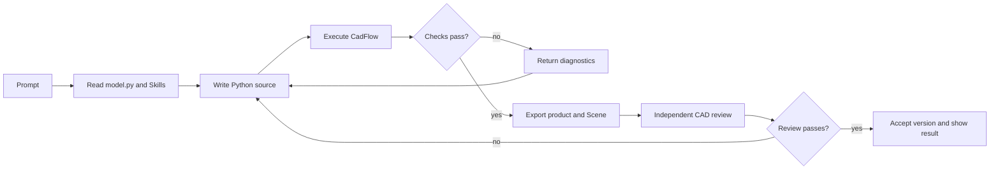

# A modeling run

A Run follows a fixed order: read the source and Skills, write Python, execute
CadFlow, check the geometry, and decide whether to accept the result. The
request and the Run time budget determine how many source revisions occur.



## What the Agent edits

The stable entry point is `/code/model.py`:

```python
import cadflow as cad


def build_model(model: cad.Model) -> cad.Shape | cad.Assembly:
    ...
```

Add helper modules under `/code/` when a task needs them. The Agent writes
Python; the executor creates the Scene, STEP, BOM, validation,
assumptions, semantic model, and source snapshot.

## Shape and Assembly

- Return a `cad.Shape` for one separately manufactured rigid part. It must be
  valid, contain exactly one solid, and have positive volume.
- Return a semantic `cad.Assembly` for separate parts, repeated instances, or
  nested subassemblies. Every leaf `cad.Part` must be a valid one-solid body
  with an identifiable ID, connectors, placements, and constraints.

The executor checks product structure, Assembly constraints and residuals, STEP
replay, Scene parsing, and the declared envelope. It writes a Draft product
bundle after those checks pass. The host saves it as an Accepted version only
after the independent `cad_review` also passes.

## Progress and errors

The Viewer receives Server-Sent Events from
`/api/projects/<project_id>/events`. It shows source and validation phases,
previews, failures, and limited output. A source revision may produce a preview
before validation finishes; previews are for troubleshooting and do not establish
acceptance.
