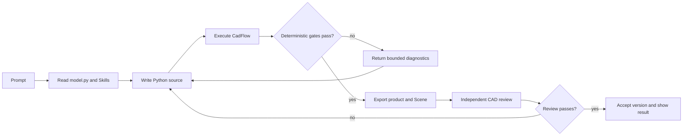

# A modeling run

The Agent follows a bounded, evidence-driven loop. The exact number of source
revisions depends on the request and the configured run budget.



## What the Agent edits

The stable entry point is `/code/model.py`:

```python
import cadflow as cad


def build_model(model: cad.Model) -> cad.Shape | cad.Assembly:
    ...
```

Focused helper modules can live under `/code/`. The Agent writes Python only;
the executor owns Scene, STEP, BOM, validation, assumptions, semantic-model,
and source-snapshot artifacts.

## Shape and Assembly results

- Return a `cad.Shape` for one separately manufactured rigid part. It must be
  valid, have exactly one solid, and have positive volume.
- Return a semantic `cad.Assembly` for separately manufactured parts, repeated
  instances, or nested subassemblies. Every leaf `cad.Part` must be a valid
  one-solid body, with meaningful IDs, connectors, placements, and constraints.

The executor checks product structure, strict constraint solving and residuals
for Assemblies, STEP replay, Scene parsing, and the declared envelope. It then
produces a Draft product bundle. The host promotes it to an Accepted version
only after the independent `cad_review` quality gate passes.

## Progress and errors

The Viewer receives Server-Sent Events from
`/api/projects/<project_id>/events`. It shows source and validation phases,
live-preview revisions, failures, and bounded output. A source revision can
produce a preview while the final validation is still running; previews are
best effort and do not establish acceptance.
