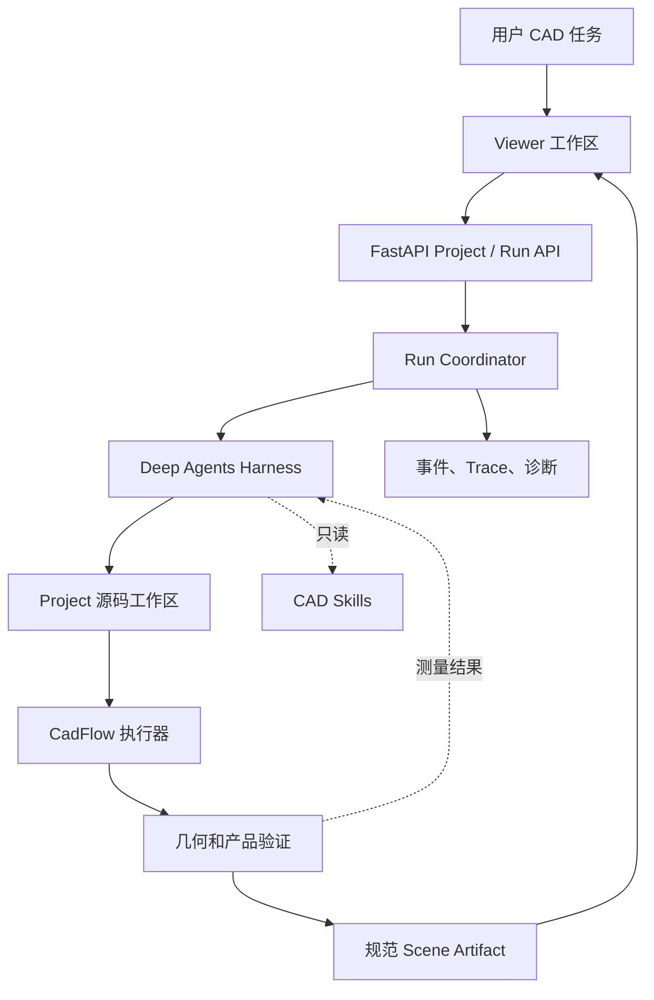

# 系统架构

系统把浏览器交互、Agent、几何执行和结果查看分开处理。它们通过 Project、Run 和 Artifact 契约连接。

## 各部分负责什么

- **Viewer**：在浏览器中管理 Project、对话、进度、预览和 Scene/产品查看。
- **FastAPI**：提供 Project、消息、预览、产物和 Trace 路由，不负责决定 CAD 建模方法。
- **Run Coordinator**：让每个 Project 同时只运行一个 turn，启动 Agent 服务，记录事件并写入终态。
- **Agent Harness**：把配置好的模型连接到受限文件工具和当前 Project 工作区。只要遵守 Run 契约，就可以替换它。
- **Project Workspace**：只向 Agent 暴露 `/code/**/*.py`。元数据、日志、预览、review 证据和产物放在工作区之外。
- **CadFlow**：构建确定性几何并导出 Scene。验证器和独立 review 根据测量结果决定是否接受版本。

仓库中的装配示例不会挂载到 Agent Run，只用于参考和测试。
