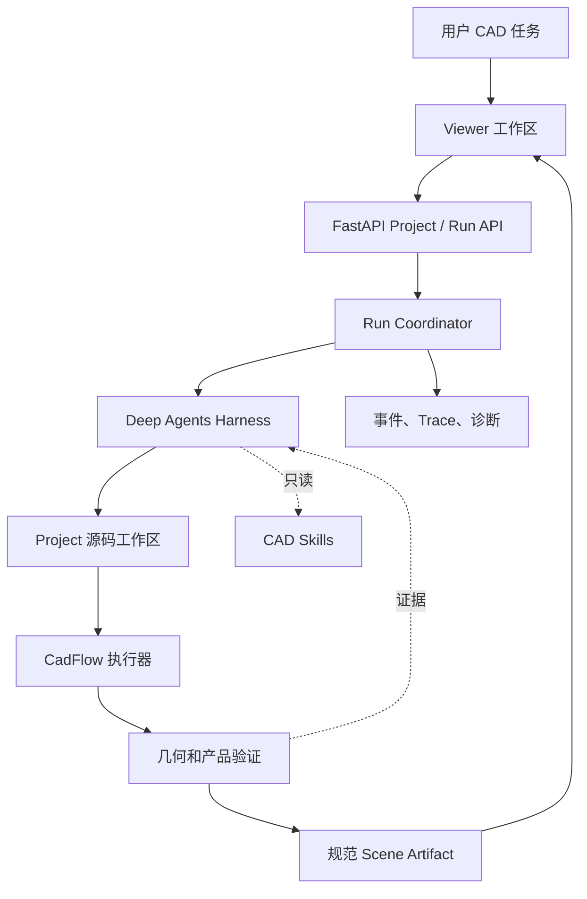

# 系统架构

CadFlow Harness 将交互、Agent 行为、确定性执行和可视化拆分为独立边界。

## 各边界的职责

- **Viewer** 在浏览器中管理 Project 选择、对话、进度、预览以及 Scene/产品检查。
- **FastAPI** 提供 Project、消息、预览、产物和可观察性路由，不自行定义 CAD 建模策略。
- **Run Coordinator** 保证每个 Project 同时只有一个 turn，启动 Agent 服务、记录事件并
  发布终态。
- **Agent Harness** 将配置好的模型连接到受限文件工具和当前 Project 工作区，可在稳定
  Run 契约后替换。
- **Project Workspace** 只包含 Agent 可见的 `/code/**/*.py`。元数据、日志、预览、review
  证据和产物保留在该挂载之外。
- **CadFlow** 构建确定性几何并导出规范 Scene；验证和独立 review 提供可测量的验收证据。

仓库还包含模块化装配示例，但示例不会挂载到 Agent Run，只作为用户和开发者的参考。
