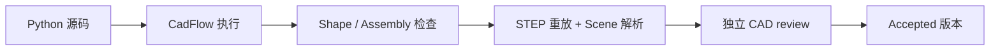

# 几何验证

运行时直接检查生成的几何。渲染结果可以帮助人查看，但单靠截图不会接受产品。

## Part 检查

对于 `cad.Shape`，执行器确认进程成功、返回一个 Shape、只包含一个有效 solid，且体积有限并为正。包围盒和其他测量值会写入诊断。

## Assembly 检查

对于 `cad.Assembly`，执行器检查语义结构、叶节点 Part、连接的单 solid、组件和独立 Part 数量、连接器和放置、严格约束求解及残差，以及 `PRODUCT_SPEC.envelope.max_size_mm`。随后重放 STEP 并解析 Scene Artifact。

## Review 与接受

早期检查通过后，执行器生成 Draft 产品包。主机会调用独立的 `cad_review` 检查导出的 STEP 和测量值；review 也通过时，Draft 才会变成 Accepted。Accepted 文件会进入版本化目录并显示在 Viewer 中。

## 验证不代表什么

当前检查不证明强度、尺寸公差、可制造性、热性能、轴承寿命、齿面应力或其他未实现的工程分析。运行时只判断几何和语义是否有效。
