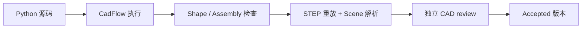

# 几何验证

运行时把几何当作可执行证据。通过渲染有助于检查，但不能单独作为产品接受依据。

## Part 检查

对于 `cad.Shape`，执行器会确认进程成功、返回一个 Shape、只包含一个有效 solid，且体积
有限并为正。包围盒和其他测量属性会保留在诊断中。

## Assembly 检查

对于 `cad.Assembly`，执行器会检查语义结构、叶节点 Part 身份、连接的单 solid、组件与独立
Part 数量、连接器和放置、严格约束求解及所有残差，以及 `PRODUCT_SPEC.envelope.max_size_mm`。
随后还会重放 STEP 并解析 Scene Artifact。

## Review 与接受

确定性执行器在早期检查通过后生成完整的 Draft 产品包。主机会调用独立的 `cad_review`，
检查导出的 STEP 和证据；只有 review 也通过，Draft 才会变成 Accepted。Accepted 文件会
进入版本化目录并显示在 Viewer 中。

## 验证不代表什么

当前检查不证明强度、尺寸公差、可制造性、热性能、轴承寿命、齿面应力或其他未实现的工程
分析。运行时范围是几何和语义有效性。
