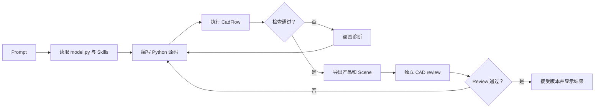

# 一次建模运行

一次 Run 会按固定顺序执行：读源码和 Skills，写入 Python，运行 CadFlow，检查几何，再决定是否接受结果。源码修改次数受需求和 Run 时间限制影响。



## Agent 修改什么

稳定入口是 `/code/model.py`：

```python
import cadflow as cad


def build_model(model: cad.Model) -> cad.Shape | cad.Assembly:
    ...
```

需要拆分代码时，可以在 `/code/` 下添加辅助模块。Agent 只写 Python；Scene、STEP、BOM、验证、assumptions、semantic-model 和源码快照由执行器生成。

## Shape 与 Assembly

- 单独制造的刚性零件返回 `cad.Shape`。它必须有效，只包含一个 solid，且体积为正。
- 独立制造件、重复实例或嵌套子装配返回语义化 `cad.Assembly`。每个叶节点 `cad.Part` 都必须是有效的单 solid，并带有可识别的 ID、连接器、定位和约束。

执行器会检查产品结构、Assembly 约束及残差、STEP 重放、Scene 解析和声明的包络。检查通过后生成 Draft 产品包；独立的 `cad_review` 也通过时，主机才会把它保存为 Accepted 版本。

## 进度与错误

Viewer 从 `/api/projects/<project_id>/events` 接收 Server-Sent Events，显示源码和验证阶段、实时预览、失败信息及有限输出。源码在最终验证完成前可能已经生成预览，但预览仅供排查，不能作为接受依据。
