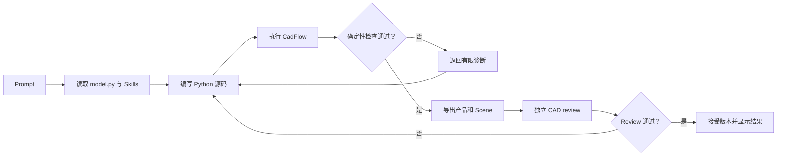

# 一次建模运行

Agent 遵循有边界、以证据驱动的循环。源码修改次数取决于需求和 Run 时间预算。



## Agent 修改什么

稳定入口是 `/code/model.py`：

```python
import cadflow as cad


def build_model(model: cad.Model) -> cad.Shape | cad.Assembly:
    ...
```

复杂需求可以在 `/code/` 下使用辅助模块。Agent 只写 Python；Scene、STEP、BOM、验证、
assumptions、semantic-model 和源码快照由执行器负责生成。

## Shape 与 Assembly 结果

- 一个单独制造的刚性零件返回 `cad.Shape`。它必须有效、只包含一个 solid，并且体积为正。
- 独立制造件、重复实例或嵌套子装配返回语义化 `cad.Assembly`。每个叶节点 `cad.Part`
  都必须是有效的单 solid，并保留有意义的 ID、连接器、放置和约束。

执行器会检查产品结构、Assembly 的严格约束求解和残差、STEP 重放、Scene 解析以及声明的
包络。随后生成 Draft 产品包；只有独立 `cad_review` 质量门也通过，主机才会将它提升为
Accepted 版本。

## 进度与错误

Viewer 从 `/api/projects/<project_id>/events` 接收 Server-Sent Events，展示源码和验证阶段、
实时预览版本、失败信息以及有限的输出。源码修改可以在最终验证期间产生预览；预览是尽力
而为的诊断信息，不能作为接受依据。
